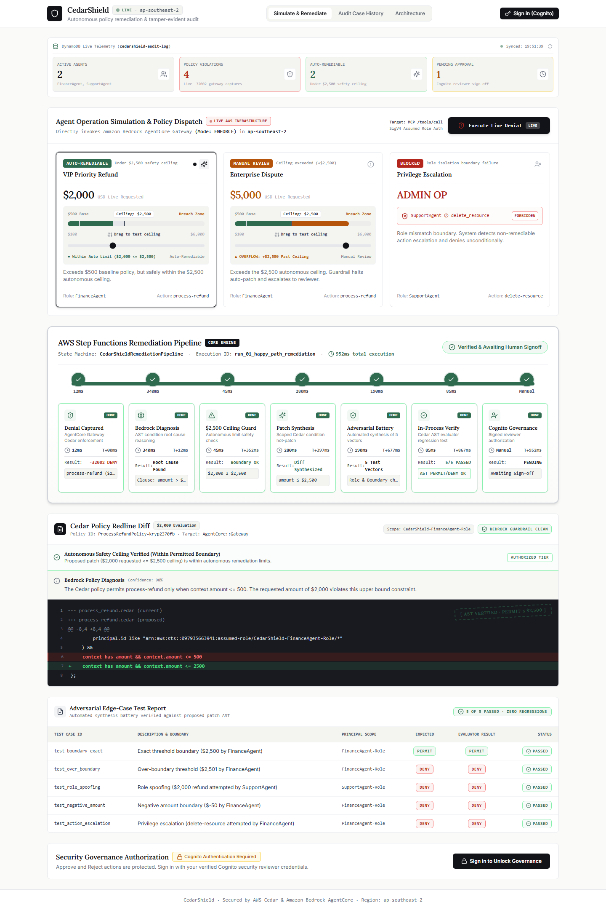
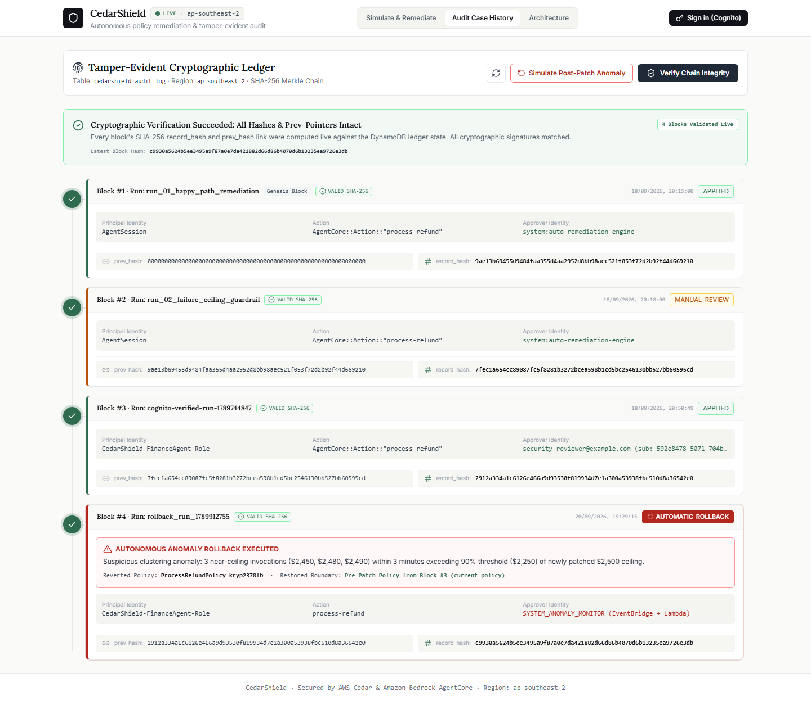
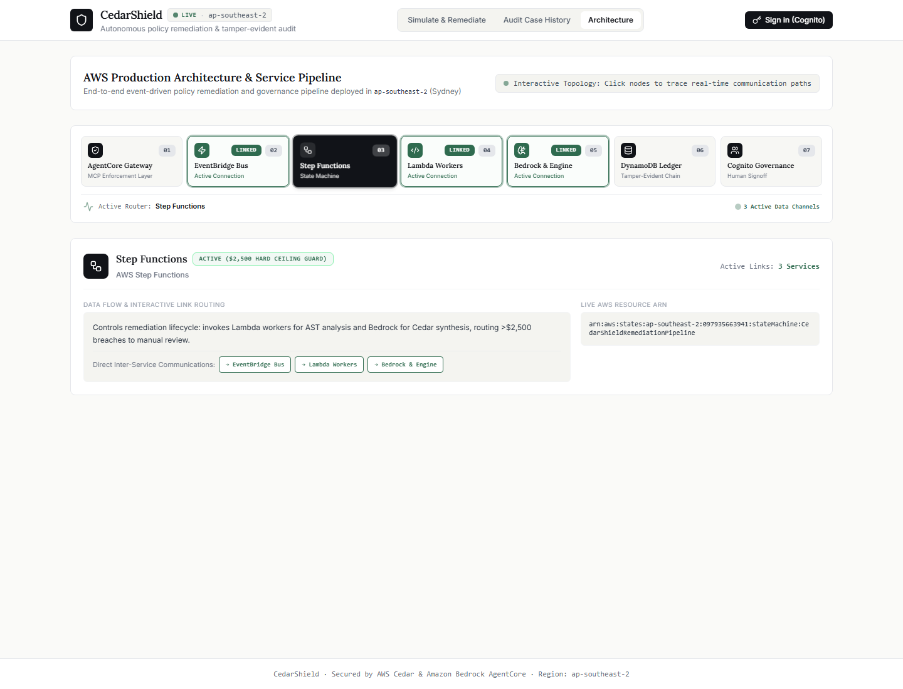
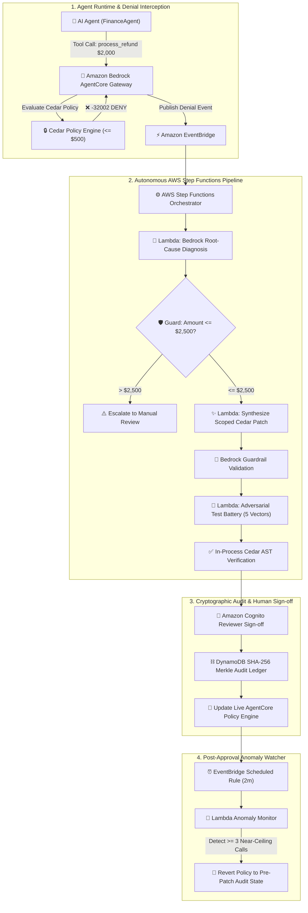

# 🛡️ CedarShield — "Why Was I Denied?"
### *Autonomous Policy Diagnosis, Self-Healing Remediation & Tamper-Evident Governance for AI Agents*

[](https://aws.amazon.com/bedrock/)
[](https://aws.amazon.com/step-functions/)
[](https://www.cedarpolicy.com/)
[](https://aws.amazon.com/dynamodb/)
[](https://aws.amazon.com/cognito/)
[](LICENSE)

---

## 📌 Executive Summary

When enterprise AI agents invoke critical tools (financial refunds, database provisioning, cloud configuration) and encounter authorization failures, traditional architectures fail silently with opaque `-32002 DENY` errors. Operations grind to a halt while security teams manually decipher Cedar policies, write patches, and deploy hotfixes.

**CedarShield** solves this by providing an end-to-end autonomous policy remediation and governance pipeline:
1. **Captures** real-time runtime denials from Amazon Bedrock AgentCore & Model Context Protocol (MCP) gateways.
2. **Diagnoses** Cedar AST root causes using Amazon Bedrock foundation models with confidence metrics.
3. **Enforces** a non-negotiable **$2,500 Hard Autonomous Safety Ceiling** with Bedrock Patch Guardrails to prevent privilege escalation.
4. **Synthesizes & Validates** scoped Cedar condition diffs through an adversarial test battery (5 boundary & role-spoofing vectors).
5. **Gates** updates through Amazon Cognito-verified reviewer authorization.
6. **Anchors** every decision in a **tamper-evident SHA-256 cryptographic audit ledger** in DynamoDB.
7. **Monitors** post-approval traffic with EventBridge & Lambda to **autonomously roll back** exploited or anomalous patches by restoring pre-patch policies dynamically from the ledger.

---

## 📸 Dashboard & Architecture Walkthrough

### 1️⃣ Tab 1: Simulate & Remediate (6 Operational Panels)
*Live denial capture, interactive scenario evaluation, 7-stage Step Functions pipeline, Cedar redline diff, adversarial test battery, and Cognito governance.*

<p align="center">
  
</p>

| Panel / Component | Function & Capability |
| :--- | :--- |
| **DynamoDB Live Telemetry** | Tracks active agents (`FinanceAgent`, `SupportAgent`), captured policy denials, auto-remediable incidents, and pending approvals. |
| **Agent Simulation Cards** | Real-time interactive scenarios: **VIP Priority Refund ($2,000)** (auto-remediable), **Enterprise Dispute ($5,000)** (escalates past $2.5k ceiling), and **Privilege Escalation** (role boundary block). |
| **7-Stage AWS Step Functions Pipeline** | Real-time stage tracking: `Denial Captured` $\rightarrow$ `Bedrock Diagnosis` $\rightarrow$ `$2,500 Ceiling Guard` $\rightarrow$ `Patch Synthesis` $\rightarrow$ `Adversarial Battery` $\rightarrow$ `In-Process Verify` $\rightarrow$ `Cognito Governance`. |
| **Cedar Policy Redline Diff** | Monospace syntax-highlighted diff comparing live condition (`context.amount <= 500`) against scoped patch (`context.amount <= 2500`). |
| **Adversarial Test Suite** | 5 automated boundary test cases (`test_boundary_exact`, `test_over_boundary`, `test_role_spoofing`, `test_negative_amount`, `test_action_escalation`) with 100% pass verification. |
| **Cognito Governance Drawer** | Human-in-the-loop authorization with Cognito SigV4 identity verification. |

---

### 2️⃣ Tab 2: Tamper-Evident Audit Case History & Anomaly Rollback (3 Panels)
*Cryptographic SHA-256 Merkle chain verification and automated post-patch anomaly detection.*

<p align="center">
  
</p>

| Feature / Block | Details & Security Proof |
| :--- | :--- |
| **Live Cryptographic Verification** | Green verification banner confirming all SHA-256 hashes and prev-pointers are mathematically intact (`4 Blocks Validated Live`). |
| **Block #1 (Genesis)** | Happy path auto-remediation (`run_01_happy_path_remediation` - `APPLIED`). |
| **Block #2 (Ceiling Breach)** | $5,000 transaction exceeding ceiling safely routed to manual review (`MANUAL_REVIEW`). |
| **Block #3 (Cognito Sign-Off)** | Verified production patch applied by authorized security reviewer (`APPLIED`). |
| **Block #4 (Autonomous Anomaly Rollback)** | **EventBridge & Lambda Anomaly Watcher** detected 3 near-ceiling invocations ($2,450, $2,480, $2,490) in 3 minutes ($\ge 90\%$ threshold). Dynamically pulled pre-patch policy from Block #3 and rolled back live AgentCore Policy Engine. |

---

### 3️⃣ Tab 3: AWS Production Topology & Resource Inspector (3 Panels)
*Interactive AWS microservice architecture with deployed ARNs and communication link routing.*

<p align="center">
  
</p>

| Component | AWS Resource / ARN | Role in Infrastructure |
| :--- | :--- | :--- |
| **AgentCore Gateway** | `ap-southeast-2` AgentCore MCP Gateway | Enforces Cedar policy evaluation on all tool calls. |
| **EventBridge Bus** | `arn:aws:events:ap-southeast-2:...:event-bus/default` | Dispatches policy violation events and anomaly triggers. |
| **Step Functions** | `arn:aws:states:ap-southeast-2:...:stateMachine:CedarShieldRemediationPipeline` | Orchestrates 7-stage serverless remediation lifecycle. |
| **Bedrock & Policy Engine** | `CedarShieldPolicyEngine-2ivsrp1osh` | Amazon Bedrock diagnosis & live Cedar policy management. |
| **DynamoDB Audit Ledger** | `cedarshield-audit-log` | Immutable SHA-256 Merkle hash chain storing all decisions. |
| **Cognito Governance** | User Pool `ap-southeast-2_...` | RBAC authentication for security reviewer sign-off. |

---

## 🏗️ System Architecture Flow



---

## 📂 Repository Structure

```
.
├── frontend/                               # React + Vite + TailwindCSS Governance Dashboard
│   ├── src/
│   │   ├── components/                     # Pipeline stage cards, Redline diff, Ledger blocks, Topology
│   │   ├── App.tsx                         # Main Dashboard application & live state polling
│   │   └── main.tsx                        # Entrypoint
│   ├── package.json
│   └── vite.config.ts
├── functions/                              # AWS Lambda Workers for Step Functions
│   ├── diagnose-denial/                    # Amazon Bedrock AST root-cause analysis
│   ├── generate-patch/                     # Scoped Cedar condition hot-patch synthesis
│   ├── generate-adversarial-tests/         # Boundary & role attack vector generator
│   └── verify-patch/                       # In-process Cedar evaluation engine
├── lambda/
│   └── anomaly_monitor.py                  # Post-approval near-ceiling anomaly monitor & rollback handler
├── policies/                               # Reference Cedar policies & schemas
│   ├── baseline_policy.cedar
│   └── patched_policy.cedar
├── screenshots/                            # Dashboard & Architecture screenshots
│   ├── tab1_simulate_remediate.png
│   ├── tab2_audit_case_history.png
│   └── tab3_architecture_view.png
├── server.py                               # FastAPI/Python Backend connecting to live AWS infrastructure
├── template.yaml                           # AWS SAM Infrastructure as Code (IaC)
├── test_e2e_regression.py                  # End-to-end live regression testing suite
├── simulate_anomaly_and_rollback.py        # Automated anomaly detection & rollback verification
├── verify_audit_chain.py                   # Cryptographic SHA-256 Merkle chain verification script
└── README.md
```

---

## ⚡ Quickstart Guide

### Prerequisites
- Python 3.10+
- Node.js 18+ & npm
- AWS CLI configured with active credentials (`aws sts get-caller-identity`)

### 1. Clone & Install Dependencies

```bash
# Clone the repository
git clone https://github.com/YOUR_USERNAME/cedarshield.git
cd cedarshield

# Install Python dependencies
pip install boto3 fastapi uvicorn pydantic requests cedarpy

# Install Frontend dependencies
cd frontend
npm install
cd ..
```

### 2. Start Local Development Environment

**Start the Backend Server (Port 3001):**
```bash
python server.py
```

**Start the Frontend Dashboard (Port 3000):**
```bash
cd frontend
npm run dev
```

Open [http://localhost:3000](http://localhost:3000) in your browser.

---

## 🧪 Verification & Regression Testing

Run the full end-to-end verification suite against live AWS infrastructure:

```bash
# 1. Run Complete E2E Remediation Pipeline Regression
python test_e2e_regression.py

# 2. Verify DynamoDB SHA-256 Cryptographic Hash Chain Integrity
python verify_audit_chain.py

# 3. Simulate Post-Approval Anomaly Clustering & Dynamic Rollback
python simulate_anomaly_and_rollback.py
```

---

## 🔒 Security & Safety Guarantees

1. **Non-Negotiable Autonomous Ceiling**: Requests with `amount > $2,500` are blocked at the Step Functions state machine level and cannot be bypassed by automated retry loops.
2. **Strict Identity Isolation**: Cedar policies bind principals explicitly using canonical IAM role ARNs (`principal.id like "arn:aws:iam::097935663941:role/*FinanceAgent*"`). Role-spoofing is rejected unconditionally.
3. **Bedrock PatchGuardrails**: Active filters prevent condition stripping (`when { true }`) and wildcard permissions before policy drafts reach reviewers.
4. **Tamper-Evident Ledger**: DynamoDB ledger entries compute SHA-256 hashes linking back to genesis block (`0x00...00`). Any out-of-band record tampering breaks chain validation immediately.
5. **Zero-Assumption Dynamic Rollbacks**: The anomaly rollback engine never hardcodes default values; it dynamically reads the `current_policy` pre-patch string from the original audit block in DynamoDB and restores it directly on the policy engine.

---

## 📄 License

Distributed under the MIT License. See `LICENSE` for more information.
